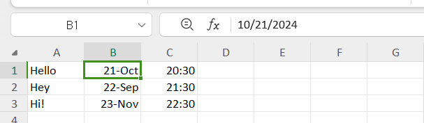

# Telegram Message Scheduler

## Project Description
This project is an automated tool for scheduling messages on Telegram. It uses computer vision and GUI automation to set dates, times, and send messages according to a predefined schedule.

## Installation

1. Clone the repository:
   ```
   git clone https://github.com/yourusername/telegram-message-scheduler.git
   cd telegram-message-scheduler
   ```

2. Install the required dependencies:
   ```
   pip install opencv-python pyautogui pandas 
   ```

3. Ensure you have the necessary image files in the `Figures`, `Months`, and `States` directories.

## Usage

1. Prepare your message schedule:
   - Create an Excel file named `messages.xlsx` in the project root directory.
   - The Excel file should have three columns: Sentence, Date, and Time.
   - Fill in your messages, dates, and times in the respective columns.
   - The Excel file should look like this:
   
   - Ensure that the Date column is formatted as a date in Excel.
   - The Time column should be formatted as time in Excel.


2. Open Telegram on your computer and navigate to the chat where you want to schedule messages.

3. Open the "Scheduled Messages" section in the chat

4. Run the script:
   ```
   python telegram.py
   ```

5. The script will:
   - Read the messages from the Excel file.
   - For each message:
     - Type the message in the Telegram chat.
     - Set the date and time for scheduling.
     - Send the scheduled message.

6. Do not interfere with your mouse or keyboard while the script is running.

Note: This script uses screen capture and image recognition. Ensure your Telegram window is visible and not obstructed during execution.

## Caution
This tool interacts directly with your GUI. Use it responsibly and in accordance with Telegram's terms of service.
